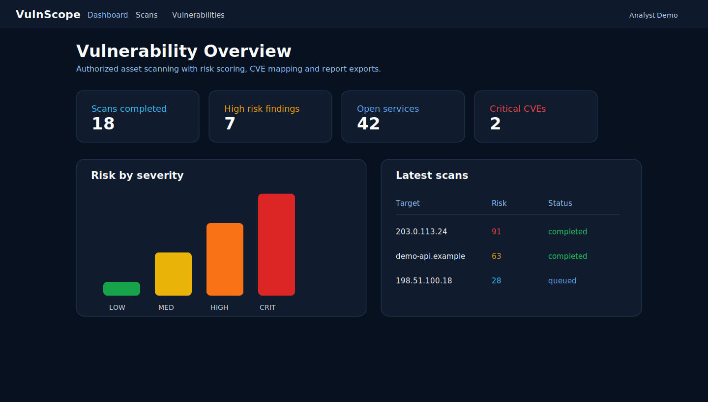
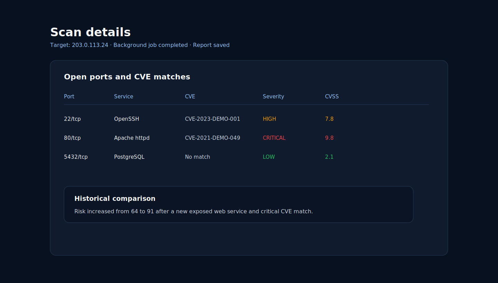

# VulnScope

VulnScope is a professional vulnerability analysis platform built as a backend and cybersecurity portfolio project.

It is more than a simple port scanner: it combines target scanning, Nmap-powered service detection, CVE enrichment, risk scoring, scan history, historical comparison and report exports inside a full-stack dashboard.

## Project Identity

**VulnScope** is a vulnerability scanner portfolio project focused on authorized target analysis, service discovery, CVE enrichment, background scan workflows and security reporting.

## Live Demo

[Open VulnScope](https://vulnscope.vercel.app)

Demo credentials:

```text
Email: admin@vulnscope.local
Password: Admin1234
```

> This is an educational portfolio environment. Only scan systems you own or are authorized to test.

## Screenshots

The screenshots below use sanitized demo data and documentation IP ranges.

### Vulnerability dashboard



### Scan details and historical comparison



## Features

- JWT authentication with a default admin user
- Role-based access control for analyst/admin scan actions
- Vulnerability scan creation
- Background scan jobs with queued/running/completed states
- Scheduled scan records for recurring analysis workflows
- TCP port scanning for selected targets
- Optional Nmap `-sV -Pn` integration with socket-scanner fallback
- Service detection for common ports
- CVE lookup engine with curated demo mappings and optional NVD lookup
- Risk score calculation
- PostgreSQL persistence with SQLAlchemy
- Scan history, dashboard metrics and executive severity trends
- Historical target comparison for new, fixed and persisting findings
- Top risk targets based on repeated scans and high severity findings
- Vulnerability listing by severity
- PDF and CSV report exports
- Saved report records linked to scans
- Docker Compose environment
- GitHub Actions CI for backend and frontend validation

## Tech Stack

| Layer | Technology |
| --- | --- |
| Frontend | React, TypeScript, Recharts, Vite |
| Backend | Python, FastAPI, SQLAlchemy |
| Database | PostgreSQL |
| Security | JWT, RBAC, TCP scanning, optional Nmap, service detection, CVE/NVD lookup, risk scoring |
| DevOps | Docker, Docker Compose, GitHub Actions |

## Architecture

```text
User
  |
  v
React Dashboard
  |
  v
FastAPI Backend
  |-- Scanner
  |-- Service Detector
  |-- CVE Engine
  |-- Risk Calculator
  |-- Report Engine
  |
  v
PostgreSQL
```

## Project Structure

```text
vulnscope/
|-- backend/
|   |-- app/
|   |   |-- api/
|   |   |-- services/
|   |   |-- models/
|   |   |-- database/
|   |   |-- utils/
|   |   `-- main.py
|   |-- Dockerfile
|   `-- requirements.txt
|-- frontend/
|   |-- src/
|   |-- Dockerfile
|   `-- package.json
|-- .github/
|   `-- workflows/
|       `-- ci.yml
|-- docker-compose.yml
|-- README.md
`-- .gitignore
```

## Run with Docker

```bash
docker compose up --build
```

Open the app:

```text
http://localhost:5174
```

API documentation:

```text
http://localhost:8001/docs
```

Default credentials:

```text
Email: admin@vulnscope.local
Password: Admin1234
```

## Testing

- Backend import and syntax validation with Python compile checks.
- Frontend production build validation with Vite.
- API smoke checks through FastAPI Swagger at `/docs`.
- Recommended next tests: scan creation, RBAC permissions, report exports and CVE lookup behavior.

## Run Locally

### Backend

```bash
cd backend
py -3 -m venv .venv
.venv\Scripts\activate
pip install -r requirements.txt
uvicorn app.main:app --reload --port 8001
```

### Frontend

```bash
cd frontend
npm install
npm run dev
```

## Useful API Endpoints

| Method | Endpoint | Description |
| --- | --- | --- |
| POST | `/auth/login` | Authenticate and return a JWT |
| POST | `/scans` | Create a vulnerability scan |
| GET | `/scans` | List scan history |
| POST | `/scans/scheduled` | Create a scheduled scan record |
| GET | `/scans/scheduled` | List scheduled scans |
| GET | `/scans/targets/{target}/history` | View historical scan summaries for one target |
| GET | `/scans/{scan_id}/compare-previous` | Compare a scan against the previous scan for the same target |
| GET | `/vulnerabilities` | List detected vulnerabilities |
| GET | `/dashboard` | Return dashboard metrics |
| GET | `/reports/{scan_id}.csv` | Export one scan as CSV |
| GET | `/reports/{scan_id}.pdf` | Export one scan as PDF |

## Safe Usage

Use VulnScope only against systems you own or have explicit permission to test.

The CVE engine uses curated demo mappings for portfolio purposes. It is designed to demonstrate backend architecture, security workflows and reporting, not to replace enterprise vulnerability scanners.

## What I Learned

- JWT authentication and role-based access control.
- FastAPI architecture for security tooling.
- TCP port scanning and Nmap service/version detection.
- Service detection and optional NVD CVE enrichment.
- PostgreSQL data modeling with SQLAlchemy.
- Background scan states and scheduled scan records.
- Historical scan comparison by target.
- Risk scoring, report generation and Dockerized execution.

## Railway / Vercel Deployment

This project is also ready for split deployment:

| Service | Platform | Root directory |
| --- | --- | --- |
| Backend API | Railway | `backend` |
| Frontend | Vercel or Railway | `frontend` |

Backend variables:

```env
DATABASE_URL=<Railway PostgreSQL URL>
JWT_SECRET=<long-random-secret>
FRONTEND_ORIGIN=<frontend-url>
USE_NMAP=false
ENABLE_LIVE_CVE_LOOKUP=false
```

Frontend variable:

```env
VITE_API_URL=<backend-api-url>
```

The provided backend Dockerfile installs Nmap, so Docker Compose can run
service/version detection locally. Use `USE_NMAP=false` in cloud environments
unless the container image includes Nmap and the platform allows the scan mode
you need.

## Roadmap

- Redis/Celery worker for high-volume scan queues
- Executing scheduled scans automatically from a worker
- Authenticated user management screen
- Deeper NVD/OSV/CIRCL provider integration
- Critical finding notifications by email or WebSocket
- Cloud deployment hardening

## Author

Built by Jenmar Rondon.

- GitHub: [jenmar23rondon-ux](https://github.com/jenmar23rondon-ux)
- Repository: [vulnscope](https://github.com/jenmar23rondon-ux/vulnscope)

## License

MIT License.
